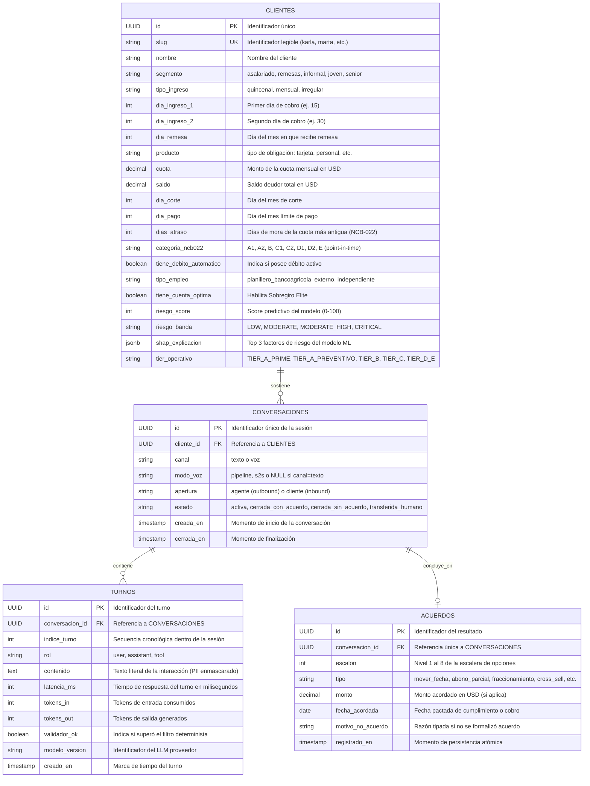
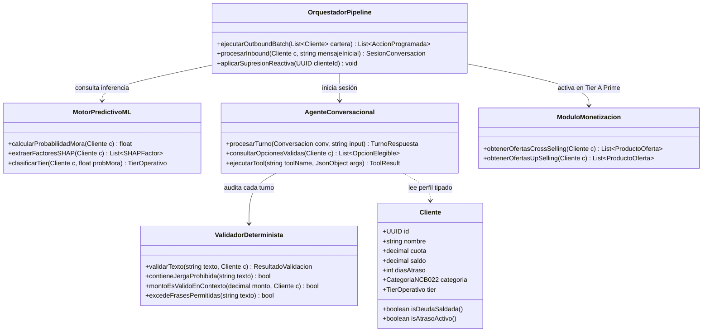
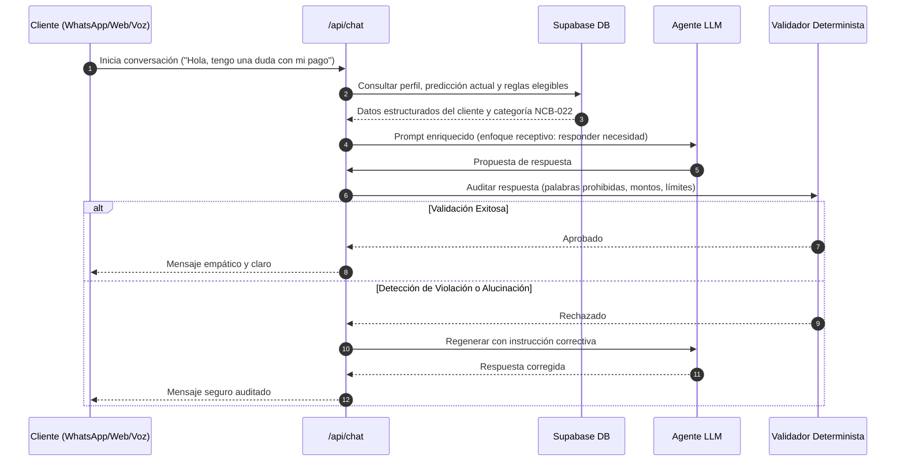

# Especificación y Diagramas UML del Dominio — Anticipa Bancoagrícola

> **Plataforma**: **Anticipa Bancoagrícola** — Motor Predictivo, Cobranza Empática y Rentabilidad Activa.
>
> Este documento especifica el modelo de datos relacional activo (PostgreSQL / Supabase), la arquitectura de clases del orquestador del agente y los diagramas de secuencia para los pipelines **Outbound** e **Inbound**.

---

## 1. Diagrama Entidad-Relación Activo (Supabase PostgreSQL)

El esquema de producción del sistema implementa las 4 tablas auditables que garantizan la trazabilidad total exigida por la Superintendencia del Sistema Financiero (SSF):



---

## 2. Diagrama de Clases del Dominio y Orquestación



---

## 3. Diagramas de Secuencia Operativos

### A. Pipeline Outbound (Batch Diario + Supresión + Segmentación de Tiers)

```mermaid
sequenceDiagram
    autonumber
    participant Core as Core Bancario (EOD)
    participant Pipe as Orquestador Batch (03:00 AM)
    participant ML as Motor ML / SHAP
    participant DB as Supabase DB
    participant Monetiza as Módulo Monetización
    participant Agente as Agente Conversacional

    Core->>Pipe: Cierre contable consolidado
    Pipe->>DB: Consultar cartera con cuotas próximas o vencidas
    DB-->>Pipe: Lista de clientes

    loop Por cada cliente
        Pipe->>Pipe: Evaluar si deuda == saldada (0 días mora)
        alt Deuda Saldada / Cuota al día (Tier A Prime)
            Pipe->>Monetiza: Obtener oferta Cross-selling / Up-selling
            Monetiza-->>Pipe: Oferta elegible (Adelanto de Salario / Extrafinanciamiento)
            Pipe->>Agente: Programar notificación comercial sin cobranza
        else Cuota Pendiente
            Pipe->>ML: Inferencia de probabilidad de mora
            ML-->>Pipe: Score + Top 3 Factores SHAP
            alt Tier A Preventivo (0-14 días)
                Pipe->>Agente: Programar recordatorio amistoso / alineación quincena
            alt Tier B o C (14-120 días)
                Pipe->>Agente: Programar recordatorio prioritario + conversación empática
            else Tier D-E+ (120-365+ días)
                Pipe->>Agente: Programar contacto formal con bypass rápido a Humano
            end
        end
    end
```

### B. Pipeline Inbound (El Cliente se Comunica)


