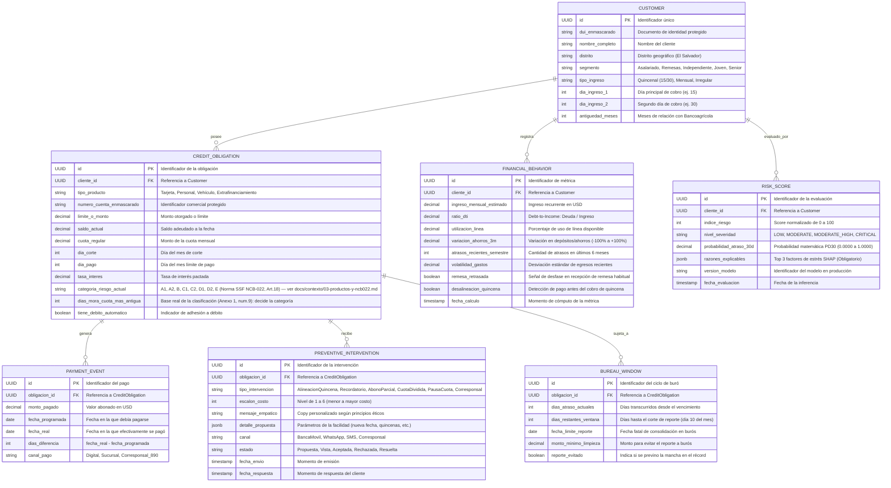
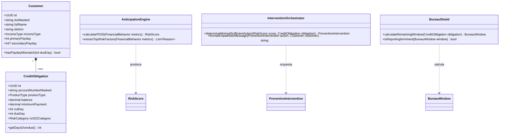

# Especificación y Diagramas UML del Dominio — Bancoagrícola EntropyHack

> **Nota de Cumplimiento Normativo del Hackathon:**
> Este documento contiene únicamente el **diseño conceptual, arquitectura de entidades y diagramas UML/ER (pseudo-esqueleto)**. 
> No contiene código ejecutable SQL ni scripts de base de datos pre-construidos, cumpliendo con la normativa del evento de no generar código previo.

> ⚠️ **Este documento describe el dominio PRE-PIVOTE (el scorer preventivo con
> pantallas), no el agente conversacional.** Quedó desalineado con el brief oficial del
> 12 de septiembre en tres puntos concretos:
>
> 1. **No tiene tabla de conversación ni de acuerdo**, que es justo la evidencia que el
>    banco pide textual ("transcripción y resultado").
> 2. `PREVENTIVE_INTERVENTION.escalon_costo` dice "1 a 6"; la escalera real tiene **8**
>    escalones.
> 3. Su enum `tipo_intervencion` no coincide con la escalera: le faltan débito
>    automático, Adelanto de Salario/Extrafinanciamiento, reestructura y pase a humano,
>    y agrega "PausaCuota"/"Corresponsal", que no son escalones. **Codificar la escalera
>    desde acá rompería el guardrail "si no está en la lista, no existe".**
>
> **Fuentes autoritativas:** la escalera y los límites de negociación están en
> `docs/contexto/01-reglas-del-agente.md` §2–§3; el esquema vigente del agente son las
> 4 tablas de `supabase/migrations/`. Este UML se conserva como referencia de dominio y
> como insumo de una fase 2.

---

## 1. Diagrama Entidad-Relación Conceptual (ERD)

---

## 2. Diagrama de Clases y Arquitectura de Dominio (UML)

---

## 3. Lógica de Interacciones y Reglas del Dominio

### A. La Regla de la Quincena (Alineación de Calendario)
* **Condición:** Si `Customer.tipo_ingreso == "quincenal"` y los días de cobro son 15 y 30, pero `CreditObligation.dia_pago` se ubica entre el día 5 y el 12.
* **Diagnóstico:** Desalineación estructural de calendario (estrés técnico por falta de liquidez post-gastos de mes).
* **Acción Orquestada:** Intervención Nivel 2: Mover la fecha de corte/pago al día 16 sin costo financiero.

### B. El Escudo de los 10 Días (Ventana Legal de Buró)
* **Condición:** Si `CreditObligation.getDaysOverdue() > 0` y la fecha actual es anterior al día 10 del mes siguiente.
* **Diagnóstico:** El cliente está en mora operativa interna, pero aún no se ha consolidado el reporte ante Equifax/TransUnion.
* **Acción Orquestada:** Notificación transparente con contador de días restantes y opción de pago mínimo/parcial para extinguir la deuda antes del corte.

### C. Inclusión de Canal Físico (890 Corresponsales)
* **Condición:** Si el cliente pertenece al segmento `senior` o no registra actividad en la banca móvil en los últimos 90 días.
* **Acción Orquestada:** Canalización vía SMS indicando la dirección del corresponsal financiero Bancoagrícola más cercano para pago presencial sin fricción digital.
