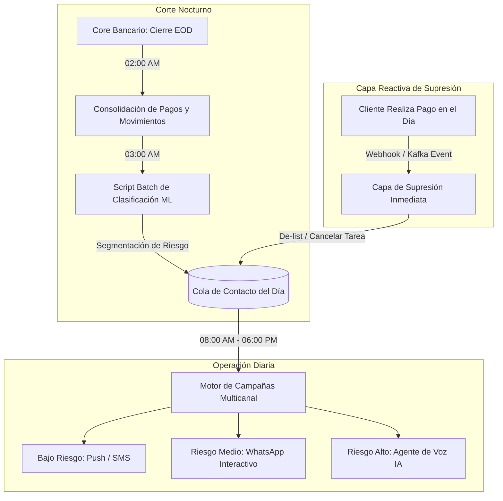

# Estrategia de Cobranza Preventiva: Frecuencia de Clasificación y Timing Óptimo de Contacto

Este documento consolida la investigación técnica, empírica y regulatoria para la optimización del motor de cobranza preventiva con Inteligencia Artificial en **Bancoagrícola (El Salvador)**. Responde a dos interrogantes operativas críticas:
1. **Frecuencia óptima de ejecución del script de clasificación de riesgo** (Machine Learning / Scoring).
2. **Tiempo regulado y óptimo de contacto preventivo antes del día de pago** (Behavioral Nudges, Economía del Comportamiento y Marco Legal SSF / Defensoría del Consumidor).

---

## 1. Frecuencia Óptima del Script de Clasificación de Riesgo

### 1.1 Contexto Operativo
* **Universo objetivo:** ~30,000 clientes en riesgo de mora temprana por mes.
* **Objetivo del modelo:** Predecir la probabilidad de impago puntual y asignar el canal de contacto de menor costo y mayor efectividad (Notificación Push, SMS, WhatsApp Interactivo o Llamada con Agente de Voz IA).

### 1.2 Evaluación Comparativa de Frecuencias

| Enfoque | Viabilidad Técnica | Viabilidad de Negocio | Veredicto | Justificación |
| :--- | :--- | :--- | :--- | :--- |
| **Semanal** | Alta (bajo costo de cómputo) | Muy baja | ❌ **Descartado** | Las fechas de pago vencen diariamente a lo largo del mes (días 5, 10, 15, 20, 25, 28, 30). Un script semanal genera desfasajes de hasta 6 días, perdiendo ventanas preventivas de 3 a 1 día antes o contactando a clientes que ya pagaron. |
| **Cada 12 Horas** | Media | Baja | ❌ **Descartado** | Las variables crediticias críticas (débitos automáticos aplicados, depósitos salariales, compensación de cheques/transferencias) consolidan en el corte nocturno. Re-clasificar a mediodía consume cómputo sin alterar las probabilidades predichas. |
| **Streaming Puro (Tiempo Real)** | Baja (alto costo de infraestructura) | Innecesaria para el modelo | ❌ **Descartado** | Mantener feature stores y modelos ML en streaming continuo para 30k clientes no agrega valor cuando la acción resultante (contactar al cliente) está restringida a horarios comerciales legales. |
| **Híbrido: Batch Diario + Supresión en Tiempo Real** | Alta (eficiente y escalable) | Óptima |  **RECOMENDADO (Estándar Bancario)** | El scoring pesado corre una vez al día tras el cierre contable; las cancelaciones por pago se procesan inmediatamente mediante eventos reactivos. |

### 1.3 Arquitectura Recomendada: "Daily Batch Scoring + Event-Driven Suppression"



1. **Batch Diario Nocturno (02:00 AM – 04:00 AM):**
   * Se dispara tras finalizar el proceso de fin de día (**End-of-Day / EOD**) del core bancario.
   * Consolida transacciones del día anterior (ventanilla, cajeros, débitos y transferencias interbancarias **Transfer365 / ACH** de El Salvador).
   * Evalúa a todos los clientes que tienen vencimiento en la ventana de los próximos 1 a 7 días y actualiza sus probabilidades de mora.
   * Genera las listas de contacto segmentadas para la jornada laboral que inicia a las 08:00 AM.
2. **Capa de Supresión en Tiempo Real (Event-Driven):**
   * Durante el día, si un cliente cancela su cuota a través de Banca en Línea, App Móvil o corresponsal financiero, se emite un evento inmediato (`payment_completed`).
   * Este evento cancela cualquier mensaje o llamada programada en la cola de salida para ese deudor, garantizando **cero llamadas a clientes que ya pagaron**.

---

## 2. Timing Óptimo de Recordatorio: Días Antes del Vencimiento

### 2.1 Evidencia Empírica de Economía del Comportamiento (Behavioral Nudges)

Diversos ensayos controlados aleatorizados (RCTs) en microfinanzas y banca minorista han cuantificado el impacto del momento exacto del recordatorio:

#### Estudio 1: Cadena & Schoar (MIT / NBER Working Paper w17020)
* **Título:** *"Remembering to Pay: Reminders vs. Financial Incentives for Loan Payments"*.
* **Metodología:** Comparación de incentivos financieros (descuentos en cuota/interés) vs. recordatorios por SMS enviados **3 días antes del vencimiento (T-3)**.
* **Hallazgo Principal:** Los recordatorios a **T-3 días** aumentaron la probabilidad de pago puntual en **7% a 9%**, un impacto estadísticamente idéntico al de otorgar descuentos en efectivo sustanciales. Demostraron que una gran proporción del impago temprano se debe a **atención limitada y procrastinación**, no a falta de solvencia.

#### Estudio 2: Karlan, Morten & Zinman (Innovations for Poverty Action - IPA / NBER w17952)
* **Título:** *"A Personal Touch: Text Messaging for Loan Repayment"*.
* **Metodología:** Variación experimental de tiempos de envío: **2 días antes (T-2)**, **1 día antes (T-1)** y **el mismo día del vencimiento (T-0)**.
* **Hallazgo Principal:** Los recordatorios enviados a **T-2 y T-1** alcanzaron la mayor efectividad para deudores que poseen liquidez pero postergan el trámite operativo.
* **Fenómeno de Decaimiento de Saliencia (*Salience Decay*):** Enviar recordatorios con más de 7 días de anticipación reduce su impacto a casi cero; el deudor pospone la acción porque percibe la fecha lejana y posteriormente la olvida.

#### Factor Local: Ciclos de Liquidez en El Salvador
* En el mercado salvadoreño, el salario formal se abona principalmente de manera **quincenal (días 14-15 y 29-30)**.
* Los recordatorios entre **T-3 y T-1** que coinciden con la entrada de liquidez compiten exitosamente por la prioridad de pago en la disponibilidad de fondos (*share of wallet*), antes de que el ingreso sea absorbido por gastos discrecionales.

---

### 2.2 Marco Regulatorio y Legal en El Salvador

Cualquier sistema automatizado de cobranza preventiva en El Salvador debe cumplir taxativamente con el marco de la **Superintendencia del Sistema Financiero (SSF)** y la **Defensoría del Consumidor (Ley de Protección al Consumidor - LPC)**:

> [!IMPORTANT]
> **Horario Legal de Contacto Obligatorio:**
> Según las reformas a la Ley de Protección al Consumidor y Ley de Telecomunicaciones, las gestiones de contacto, cobro y mensajería (SMS, WhatsApp y llamadas automatizadas o humanas) **solo pueden efectuarse de lunes a viernes, entre las 8:00 a.m. y las 6:00 p.m.** Contactar fuera de este horario o durante fines de semana y feriados constituye infracción legal grave.

> [!WARNING]
> **Prohibición de Cobranza Abusiva y Hostigamiento (Art. 18 lit. f LPC):**
> Se prohíbe realizar gestiones intimidantes, humillantes o que vulneren la privacidad del usuario. En cobranza preventiva (cuotas no vencidas), la comunicación debe tener un **enfoque de servicio, recordatorio y facilitación de canales de pago**, jamás coercitivo ni de advertencia punitiva.

> [!NOTE]
> **Derecho a Atención Personalizada y Escalación Humana:**
> La normativa exige que los usuarios no queden cautivos en sistemas 100% automatizados. Cualquier Voice Agent o Chatbot debe permitir la derivación directa a un ejecutivo humano si el cliente lo requiere.

> [!NOTE]
> **Normativa de Riesgo Crediticio SSF (Normas NCB-022 / NCBC-022):**
> La clasificación de riesgo se evalúa mensualmente de forma puntual (*point-in-time*), según los días de mora de la cuota impagada más antigua:
> * **Categoría A1 (0 días):** Al día o deuda saldada (reserva 0% a 1%).
> * **Categoría A2 (1 a 30 días de atraso):** Reserva mínima del 1%.
> * **Categoría B (31 a 60 días de atraso):** Reserva del 5%.
> * **Categoría C1 y C2 (61 a 120 días):** Reserva del 15% al 30%.
> * **Categoría D y E (121 a +180 días):** Reserva del 50% al 100%.
> La cobranza preventiva cuida que el cliente no rebase la frontera de los 30 días (evitando caer a Categoría B), liberando provisiones de capital para el banco.

---

### 2.3 Estrategia Operativa por Tiers y Playbook de Contacto

```
                                  MAPEO POR TIERS
┌─────────────────┬─────────────────┬───────────────────────────────────────────────┐
│ Tier Operativo  │ Días de Atraso  │ Acción Estratégica del Sistema               │
├─────────────────┼─────────────────┼───────────────────────────────────────────────┤
│ Tier A Prime    │ Deuda saldada/0d│ Bypass cobranza + Cross/Up-selling activo     │
│ Tier A Prev.    │ 0 a 14 días     │ Recordatorio amigable / Alineación quincena   │
│ Tier B          │ 14 a 31 días    │ Recordatorio prioritario + Agente conversador │
│ Tier C          │ 32 a 120 días   │ Negociación estructurada de alivio financiero │
│ Tier D-E+       │ 120 a 365+ días │ Recordatorio formal + Bypass rápido a humano  │
└─────────────────┴─────────────────┴───────────────────────────────────────────────┘
```

| Momento / Segmento | Canal | Audiencia Objetivo | Objetivo del Contacto | Tono / Contenido |
| :--- | :--- | :--- | :--- | :--- |
| **Tier A Prime (Día de cobro)** | Push / WhatsApp Banner | Clientes con deuda saldada o 0 mora | **Rentabilidad Activa (Cross/Up-selling)** | "Felicidades por tu récord impecable. Tienes pre-aprobado tu Adelanto de Salario / Extrafinanciamiento en 1 clic." |
| **T-5 / T-4 días** | Push Notification App / SMS | Cartera general con vencimiento próximo | Pre-aviso pasivo de bajo costo | "Hola [Nombre], tu cuota de Bancoagrícola vence el [Fecha] por $[Monto]." |
| **T-3 días (Tier A / B)** | **WhatsApp Interactivo** | Cartera completa que aún no ha pagado | **Ventana Óptima de Decisión** (Cadena & Schoar) | Mensaje con botones: *Pagar en Línea*, *Mover a mi quincena*, *Hablar con asesor*. |
| **T-1 día (Tier B / C)** | **Agente Conversacional (Chat / Voz)** | **Clientes con probabilidad de mora alta** | Compromiso de pago y resolución empática | "Hola [Nombre], te saludo de Bancoagrícola. Vemos que tu fecha de pago vence mañana. ¿Te sirve que revisemos tu fecha para que coincida con tu quincena?" |
| **Tier D-E+ (120-365+ d)** | WhatsApp formal / Llamada | Cartera en mora severa | Notificación formal y **derivación prioritaria a humano** | "Hola [Nombre], queremos apoyarte con una solución personalizada. Te conectamos de inmediato con un ejecutivo especialista." |

---

## 3. Resumen de Decisiones de Arquitectura e Implementación

1. **Periodicidad del Modelo:** **Ejecución Batch Diaria a las 03:00 AM** con supresión reactiva por webhooks en caso de pago durante el día.
2. **Ventana de Contacto Preventivo:**
   * **Tier A Prime:** Ofertas comerciales oportunas cuando la cuenta está al día.
   * **Primer contacto preventivo digital:** **T-3 días** (WhatsApp interactivo con facilidades de pago).
   * **Contacto Conversacional:** **T-1 día** para perfiles con alerta de impago.
   * **Tier D-E+:** Menor esfuerzo del bot y transferencia inmediata a ejecutivo humano.
3. **Restricciones de Ventana Operativa:**
   * Llamadas y mensajes exclusivamente en días hábiles (**Lunes a Viernes de 8:00 AM a 6:00 PM**).
   * Cancelación automática de contacto si el cliente transfiere o paga antes del intento.
