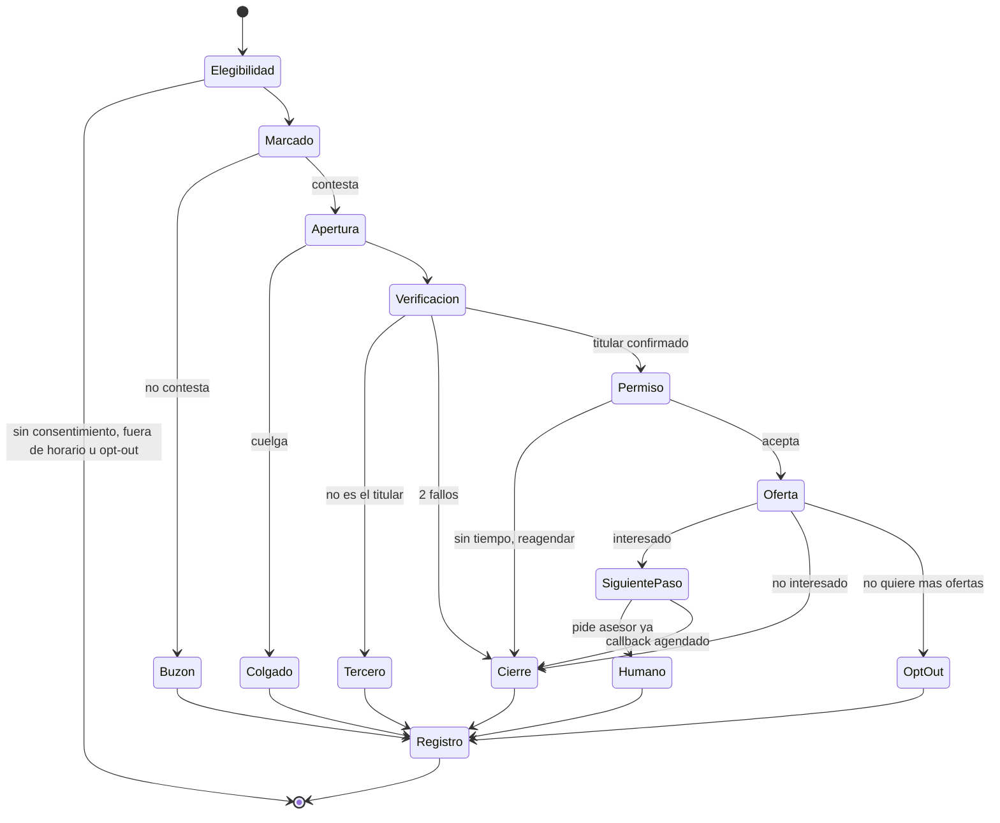
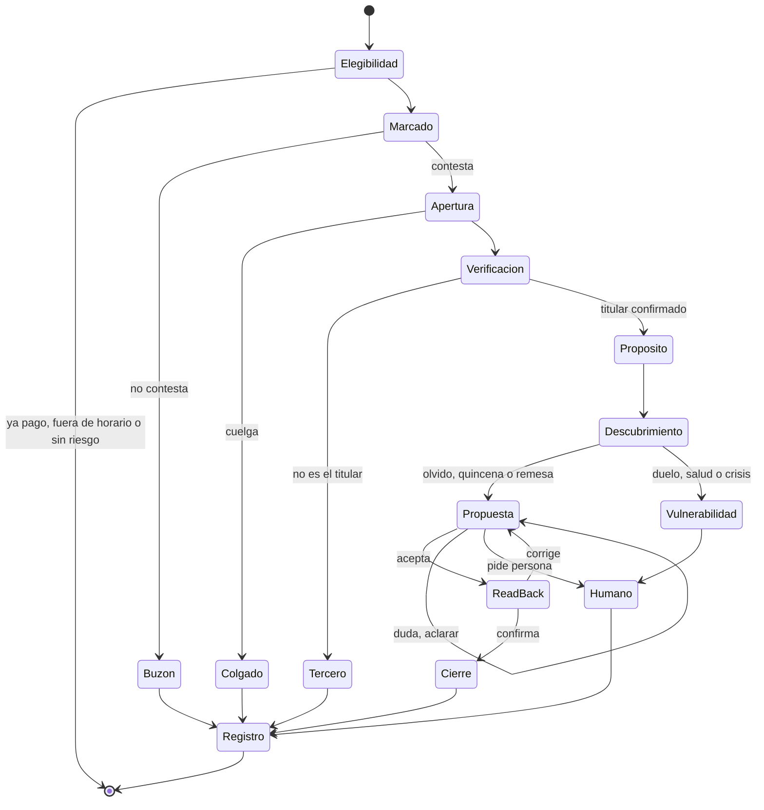
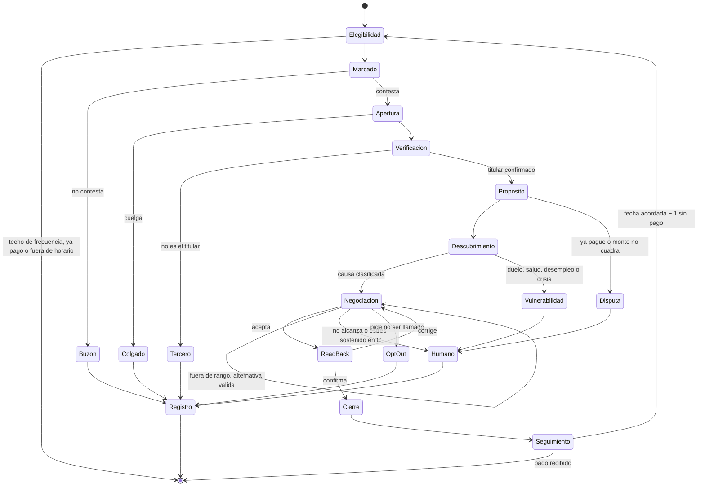
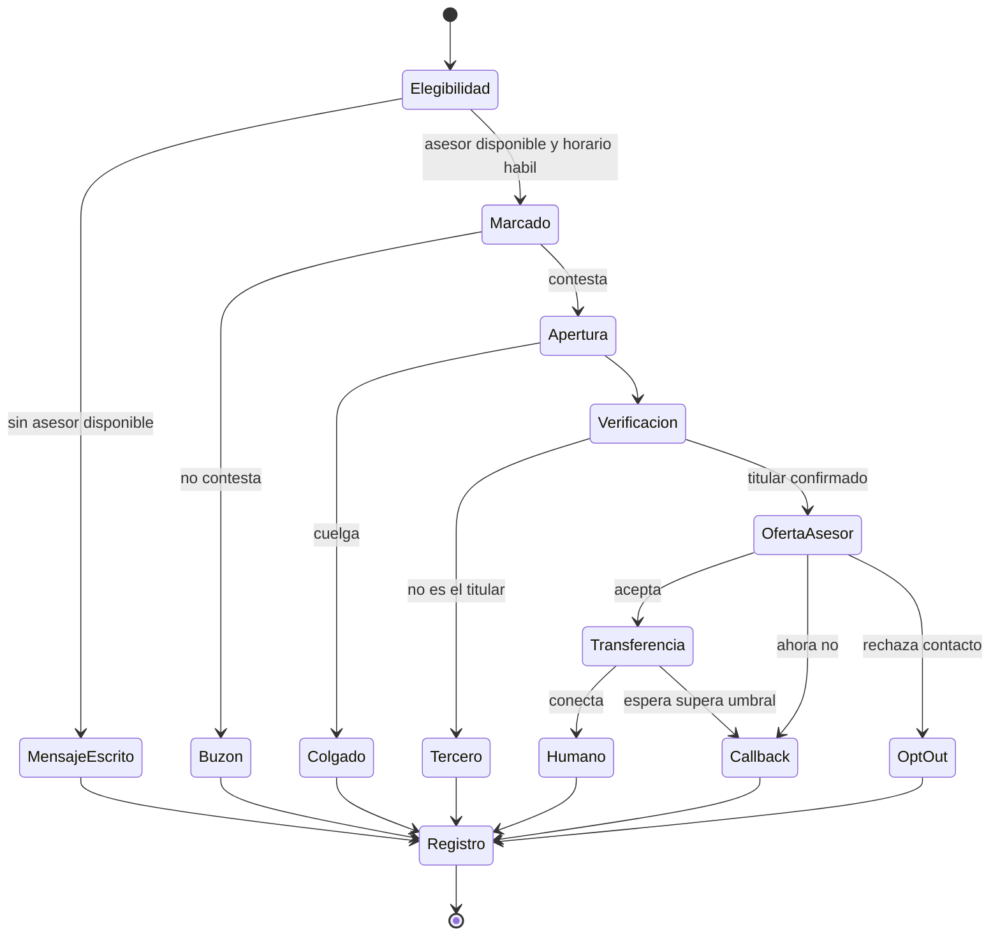
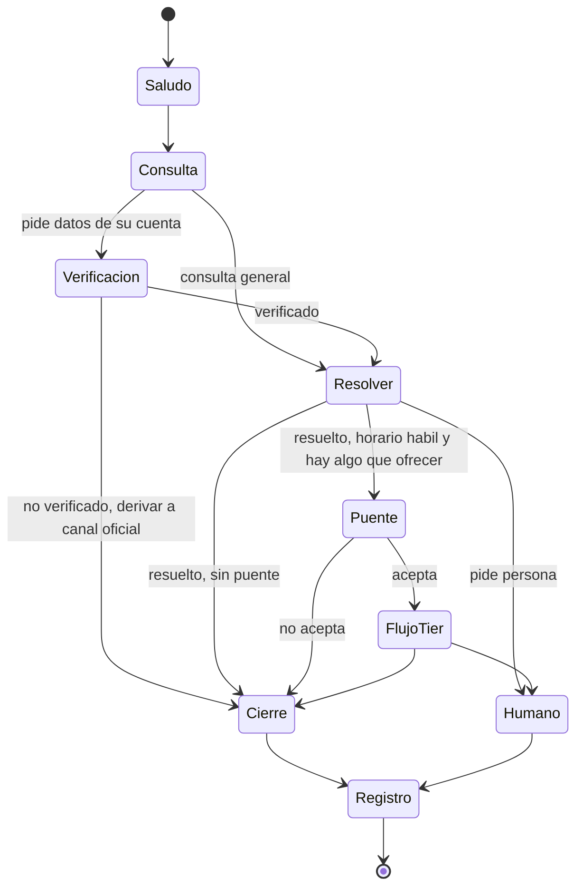

# Journey map de las llamadas: Anticipa Bancoagrícola

> Investigación hecha el **13 de septiembre de 2026** con el prompt de
> [`prompt-investigacion-journey-map.md`](prompt-investigacion-journey-map.md).
> Es para el equipo que implementa el guion, los estados y el validador del agente de voz y de texto.

**Cómo leerlo**

| Marca | Significa |
|---|---|
| **[E]** | **Evidencia**: sale de una fuente citada (ley, estudio o documento oficial) |
| **[R]** | **Recomendación**: es criterio propio, construido sobre la evidencia |
| **⚠️ Conflicto** | Lo que dice la evidencia choca con un guardrail o con un dato que ya usa el proyecto. No se resolvió en silencio: queda para decidir |
| **Análogo** | Norma de otro país (EE. UU., Reino Unido, UE) que se usa como referencia porque no se encontró la equivalente salvadoreña |

Las leyes salvadoreñas se leyeron en su texto (PDF oficial extraído), no en resúmenes, salvo donde se indica.

---

## 1. Resumen ejecutivo

1. **[E] El horario legal cubre la cobranza y también la venta.** El artículo 18, literal n) de la
   Ley de Protección al Consumidor (LPC), añadido por el Decreto Legislativo 282 de 2019, prohíbe
   hacer gestiones *"con fines comerciales y publicitarios, así como de cobros"* fuera de *"lunes a
   viernes, desde las ocho de la mañana hasta las seis de la tarde"*, por llamada, SMS, correo *"u otras
   modalidades"*. **[R]** Esto afecta también al Tier A Prime (cross-sell). Ningún outbound puede salir
   fuera de ese horario, sin importar el Tier.
2. **⚠️ Conflicto. Los sábados son el mejor día para contactar, pero en El Salvador está prohibido.** En
   el estudio del *Journal of Finance* (2025), a los que se llamó primero en sábado se les
   contactó en el 96 % de los casos, contra el 43 % en lunes. **[R]** Queda descartado: la ley
   salvadoreña manda.
3. **[E] Revelar el atraso a quien contesta es compartir información crediticia sin autorización.**
   Lo prohíben el Art. 18 lit. g) de la LPC y el Art. 29 lit. g) de la Ley de Historial de Crédito
   (infracción *muy grave*). **[R]** La verificación de identidad tiene que ser una **compuerta de código**
   antes de decir cualquier monto, fecha o atraso, y no depender de lo que diga el modelo.
4. **⚠️ Conflicto. La cita que justifica "una sola acción" en [`01-reglas-del-agente.md`](contexto/01-reglas-del-agente.md) (regla 7) está mal.**
   El estudio de PNAS 2025 (13 millones de personas) encontró que **repetir dos acciones en dos correos
   fue algo *más* efectivo** que sugerir una por correo (−0.05 pp de morosidad, p = 0.058), y los autores
   advierten sobre *"the risks of oversimplification"*. **[R]** En voz conviene seguir con una
   acción por turno, pero por la memoria de trabajo del oyente y el límite de 2–3 frases. Hay que
   corregir la justificación: el estudio no dice eso, y un jurado técnico lo puede detectar.
5. **[E] Hablar con una persona del banco sube el pago a tiempo en 34.4 pp** (efecto local, LATE; el
   efecto promedio estimado es cerca de la mitad) y **baja la reincidencia**. Lo que explica el efecto es
   el cumplimiento de la promesa, no que la llamada funcione como recordatorio, y **qué tan agradable
   suena la voz del agente cambia el pago** (Laudenbach y Siegel, *JF* 2025). **[R]** La calidad de
   la voz TTS y el acento salvadoreño son decisiones de negocio, no de estética. El pase a humano del
   Tier D–E+ tiene respaldo empírico.
6. **⚠️ Conflicto. Decir que es una IA baja la conversión**: en llamadas de venta, revelarlo antes de
   la conversación redujo las compras en más de 79.7 % (Luo et al., *Marketing Science* 2019). La
   mitigación que propone el paper, revelarlo tarde, **choca con el guardrail de transparencia** y
   con la tendencia regulatoria (EU AI Act Art. 50, vigente desde el 2 ago 2026, como análogo).
   **[R]** Mantener la divulgación en el primer turno y compensar con competencia, calidez y salida
   inmediata a humano.
7. **[E] Un compromiso con fecha *y hora* se cumple más que uno con fecha sola**: +4.2 pp frente a
   +1.5 pp no significativo (Milkman et al., PNAS 2011). **[R]** Un acuerdo registrable debe tener
   **monto + fecha + momento del día + canal de pago**, leído en voz alta y confirmado.
8. **⚠️ Conflicto. El escalón 6 (Adelanto de Salario / Extrafinanciamiento) ofrecido a alguien con
   atraso** es exactamente lo que la FCA prohíbe presionar: *"raise funds to repay the debt by…
   borrowing money"* (CONC 7.3.10R, análogo). **[R]** Restringirlo en código: solo en Tier A o B temprano,
   solo si la persona dice que necesita liquidez puntual, nunca con vulnerabilidad detectada y nunca
   como condición de otro arreglo (LPC Art. 18 lit. a).
9. **[E] El buró tras la reforma de 2021**: los bancos reportan en los primeros 10 días del mes, las
   agencias actualizan cada 15 días, el finiquito y el reporte de cancelación salen en 7 días y el dato
   negativo se elimina *al día hábil siguiente de la cancelación total*. **⚠️** La fuente dice
   "cancelación total del crédito". **No se verificó que aplique a ponerse al día en un crédito que
   sigue vigente**, que es lo que el prompt le permite prometer al agente. **[R]** Limitarlo a frases aprobadas
   hasta que legal del banco lo confirme.
10. **[E] Los pedidos de "no me llamen" se ignoran mucho**: más del 40 % de las personas contactadas pidió
    que dejaran de contactarlas y tres de cada cuatro dicen que no les hicieron caso (encuesta CFPB).
    **[R]** El opt-out debe ser un evento de primera clase: se registra, se respeta por canal y
    el validador lo detecta.

---

## 2. Fases canónicas y cómo cambian por tipo de llamada

**[E]** La secuencia común en guías de cobranza y en el protocolo del banco del estudio de
Laudenbach y Siegel es: presentarse, informar, pedir el pago, acordar un plazo y enviar una
confirmación escrita después de la llamada. **[R]** Para este producto se expande así:

| Fase | Preventiva (A Prime / A Prev.) | Temprana (B) | Tardía (C) | Muy tardía (D–E+) | Inbound |
|---|---|---|---|---|---|
| 0. Pre-llamada (elegibilidad) | Horario, consentimiento, supresión si ya pagó | + techo de frecuencia | + techo de frecuencia | + disponibilidad de humano | No aplica: el cliente inicia |
| 1. Apertura y divulgación | Breve y en positivo | Neutra | Neutra | Formal y breve | "¿En qué te ayudo?" |
| 2. Verificación de identidad | Ligera, pero obligatoria antes de datos | Obligatoria | Obligatoria | Obligatoria | Solo si pide datos de su cuenta |
| 3. Propósito | Recordatorio u oferta | Cuota pendiente, sin culpa | Cuota pendiente, sin culpa | Saldo pendiente y oferta de asesor | Resolver su consulta |
| 4. Descubrimiento | Mínimo: ¿te queda bien la fecha? | **Central**: la causa | **Central**: puntual o sostenido | Casi nulo: lo hace el humano | Solo si abre la puerta |
| 5. Negociación | Escalones 1, 2, 4 | Escalones 1–6 | Escalones 3, 5, 7, 8 | Escalón 8 | Según Tier, con permiso |
| 6. Compromiso (read-back) | Sí | **Sí, estricto** | **Sí, estricto** | Compromiso de callback | Sí, si hubo acuerdo |
| 7. Cierre y salida a humano | Sí | Sí | Sí | Es el objetivo | Sí |
| 8. Registro y seguimiento | Confirmación escrita | Recordatorio el día antes de la fecha acordada | Ídem | Resumen para el humano | Ídem |

---

## 3. Journey map por tipo de llamada

> En todas las tablas, los diálogos cumplen los guardrails: voseo, máximo 3 frases, una sola acción,
> sin jerga y sin inventar tasas ni productos. Los montos y las fechas son de los personajes del seed.

### 3.1 OUTBOUND · Tier A Prime: cross-sell y up-sell

| Fase | Objetivo | Qué dice o hace el agente | Qué siente o piensa el cliente | Puntos de dolor | Señales que detecta | Transición / salida | Guardrail | Métrica |
|---|---|---|---|---|---|---|---|---|
| 0. Pre-llamada | Decidir si se llama | *(sin voz)* Revisa L–V 8:00–18:00, consentimiento para ofertas, que no haya opt-out, que no haya vulnerabilidad registrada y que no hubo contacto comercial reciente | — | Una oferta no pedida molesta | `consentimiento_ofertas`, `opt_out`, `ultimo_contacto_comercial` | Si falla cualquier regla → **no se marca** | LPC 18 n; Ley de Datos Personales | % suprimidos por regla |
| 1. Apertura | Ganar confianza en 10 s | "Hola, buenas tardes. Te habla el asistente virtual de Bancoagrícola y esta llamada queda grabada. ¿Hablo con Marta Cruz?" | "¿Me quieren vender algo? ¿Será estafa?" | Miedo al fraude telefónico | Silencio, "¿de dónde llama?" | Confirma → 2 · No es → *Tercero* · Cuelga → *Colgado* | Divulgar IA; avisar grabación | % cuelgues antes de 15 s |
| 2. Verificación | Confirmar al titular sin pedir datos sensibles | "Gracias, Marta. Para cuidar tu información, ¿me confirmás tu fecha de nacimiento? Nunca te voy a pedir claves ni códigos." | "Bueno, al menos no me pide la clave" | Sentir que la interrogan | Dato incorrecto, duda | 2 fallos → cerrar sin revelar nada | LPC 18 g | RPC verificado |
| 3. Permiso | Pedir tiempo | "Te llamo por algo bueno de tu cuenta, no por ningún pago. ¿Tenés un minuto?" | Alivio | Momento inoportuno | "Voy manejando", "estoy en el trabajo" | No → reagendar en horario hábil · Sí → 4 | Una acción | % que da permiso |
| 4. Reconocimiento y oferta | Reforzar el buen hábito y hacer **una** oferta | "Por tus pagos puntuales calificás para el Adelanto de Salario. ¿Querés que un asesor te llame para contarte las condiciones?" | Curiosidad o sospecha | "¿Cuánto cobran?" | Pregunta por la tasa | Pregunta tasa → "Ese dato te lo confirma el asesor exacto" · Interés → 5 · No → 6 | No inventar tasas; solo productos precalificados en código | % interés |
| 5. Siguiente paso | Pasar a un trámite real | "Perfecto. Un asesor te llama mañana entre 9 y 12. ¿Te queda bien ese horario?" | Control | Esperar sin saber cuándo | Pide otro horario | Acepta → 7 · Pide humano ya → *Humano* | Horario hábil | % callbacks cumplidos |
| 6. Respuesta negativa | Cerrar sin presión y preguntar la preferencia | "No hay problema. ¿Querés que te sigamos avisando de opciones así, o preferís que no?" | Respeto | Insistencia | "No me vuelvan a llamar" | Opt-out → registrar · Sigue → 7 | Opt-out; no insistir | % opt-out |
| 7. Cierre y registro | Dejar constancia | "Listo, Marta, quedó anotado. Gracias por tu tiempo y que te vaya bien." | Satisfecha | — | — | Registrar resultado, consentimiento y opt-out | — | CSAT post-llamada |

**[R] Notas del Tier A Prime**
- Una sola oferta por llamada y **nunca en la misma llamada que un recordatorio de pago**. Mezclar las dos
  cosas convierte la oferta en presión.
- **[E]** No hay datos públicos confiables de tasa de aceptación de cross-sell por voz IA en banca de
  LATAM. Lo que publican los proveedores es marketing (ver bibliografía, confianza baja). Hay que medirlo en el piloto.
- **[E]** La Ley de Historial de Crédito (Art. 29 lit. g) prohíbe usar la información crediticia
  *"en términos diferentes a los establecidos en esta Ley"* sin consentimiento expreso. **[R]** Antes de
  usar el récord de pagos como argumento comercial, confirmar con legal que el consentimiento del
  cliente lo cubre.

### 3.2 OUTBOUND · Tier A Preventivo: recordatorio amigable

| Fase | Objetivo | Qué dice o hace el agente | Qué siente o piensa el cliente | Puntos de dolor | Señales que detecta | Transición / salida | Guardrail | Métrica |
|---|---|---|---|---|---|---|---|---|
| 0. Pre-llamada | Llamar al riesgo, no a todos | *(sin voz)* Solo si el modelo marca riesgo o hay desalineación de calendario; canal de menor costo primero (SMS/WhatsApp ~3 días antes); **supresión reactiva** si paga | — | Que llamen a quien ya pagó | `pago_hoy`, `riesgo`, `desalineacion` | Pagó → cancelar | LPC 18 n | % contactos a clientes que ya habían pagado (meta: 0) |
| 1. Apertura | Confianza | "Hola, buenas. Te habla el asistente virtual de Bancoagrícola y la llamada queda grabada. ¿Hablo con Karla Menjívar?" | "¿Qué pasó?" | Asustarse por una llamada del banco | Tono tenso | Igual que 3.1 | Divulgar IA | % cuelgues antes de 15 s |
| 2. Verificación | Titular confirmado | Igual que 3.1 | — | — | — | — | LPC 18 g | RPC verificado |
| 3. Propósito | Recordar sin alarmar | "Te llamo para recordarte que tu cuota de $145 vence el 8. ¿Esa fecha te queda bien o se te complica?" | "Uy, cierto" o "siempre se me complica" | Sentirse vigilada | "Siempre se me complica", "hasta el 15 me cae" | Olvido → 5 (escalón 1) · Desalineación → 5 (escalón 2) | Sin urgencia falsa | % que reconoce la fecha |
| 4. Descubrimiento | Distinguir olvido de calendario | "¿Cuándo te cae tu pago normalmente, el 15 y el 30?" | Se siente entendida | Explicar su vida | Quincena, remesa, olvido recurrente | → 5 con la causa | No juzgar | % con causa identificada |
| 5. Propuesta | Escalón mínimo | "Podemos mover tu fecha de pago al 16, un día después de tu quincena y sin costo. ¿Te la dejo fija para el 16?" | "¡Eso me sirve!" | Letra pequeña | Acepta, duda | Acepta → 6 · Duda → aclarar · Olvido recurrente → escalón 4 | Escalera en código | % acuerdo |
| 6. Compromiso (read-back) | Confirmación explícita | "Entonces queda así: tu cuota de $145 pasa a vencer el 16 de cada mes. ¿Me confirmás que está bien?" | Tranquila | Malentender el cambio | "Sí" explícito | Sí → 7 · No → 5 | Monto y fecha exactos | % read-back confirmado |
| 7. Cierre | Confirmación escrita y salida a humano | "Listo, te mando la confirmación por mensaje. Si algo cambia, podés hablar con un asesor cuando querás." | Satisfecha | — | — | Registrar `acuerdo` y enviar confirmación | Siempre ofrecer humano | CSAT; % pago a tiempo |

**[E]** Un SMS enviado **3 días antes** del vencimiento subió el pago puntual entre 7 % y 9 % en microcrédito en
Uganda, un efecto parecido a bajar el costo del préstamo un 25 % (Cadena y Schoar, NBER 2011). Los recordatorios
personalizados funcionan mejor: el SMS con el nombre del oficial de crédito solo funcionó cuando el
cliente ya lo conocía (Karlan, Morten y Zinman, 2015).
**[R]** El recordatorio escrito va primero y la llamada se reserva para riesgo alto o desalineación estructural.

### 3.3 OUTBOUND · Tier B (14–31 días) y Tier C (32–120 días): gestión empática

| Fase | Objetivo | Qué dice o hace el agente | Qué siente o piensa el cliente | Puntos de dolor | Señales que detecta | Transición / salida | Guardrail | Métrica |
|---|---|---|---|---|---|---|---|---|
| 0. Pre-llamada | No acosar | *(sin voz)* L–V 8–18 · máx. 1 intento por día · techo de 7 intentos en 7 días (análogo Reg F) · no volver a llamar en 7 días tras una conversación, salvo que la fecha acordada ya haya pasado sin pago · supresión si paga | — | Llamadas "repetitivas" | `intentos_7d`, `ultima_conversacion`, `promesa_vigente` | Techo alcanzado → no marcar | LPC 18 n ("repetitivos") | Intentos por RPC |
| 1. Apertura | Confianza | "Hola, buenas tardes. Te habla el asistente virtual de Bancoagrícola y la llamada queda grabada. ¿Hablo con Sandra Beltrán?" | "Ya sé para qué me llaman" | Vergüenza, ganas de colgar | Evasión | Igual que 3.1 | Divulgar IA | % cuelgues antes de 15 s |
| 2. Verificación | Titular confirmado | Igual que 3.1 | — | — | — | **No se menciona nada del crédito antes de verificar** | LPC 18 g; Hist. 29 g | RPC verificado |
| 3. Propósito sin culpa | Nombrar el tema con respeto | "Te llamo por tu cuota de $210 que quedó pendiente. Quiero ayudarte a ponerla al día sin complicarte. ¿Qué pasó este mes?" | "No me está regañando" | Sentirse juzgada | Tono, primeras palabras | → 4 | No culpar; no amenazar | % que explica la causa |
| 4. Descubrimiento de la causa | Clasificar: olvido · calendario · liquidez puntual · estrés sostenido · vulnerabilidad | Preguntas abiertas, una por turno: "¿Es algo de este mes nada más, o viene pasando desde hace un tiempo?" · "¿Cuándo te entra el dinero normalmente?" | Alivio de poder explicar | Contar algo íntimo | Duelo, enfermedad, desempleo, crisis → **salida a vulnerabilidad** | Causa clara → 5 · Vulnerabilidad → árbol §5 | No juzgar; TEXAS | % con causa clasificada |
| 5. Negociación (escalón mínimo) | Una opción sostenible | "Con los $170 que ya tenés podés abonar el viernes 19, y lo que falta lo dejamos para el 30, después de tu quincena. ¿Te funciona así?" | "Eso sí me alcanza" | Opciones que no alcanzan | Rechazo, contraoferta fuera de rango | Acepta → 6 · Fuera de rango → alternativa válida más cercana · No alcanza → subir escalón | Plazos en rango; cero condonación; CONC 7.3.5B (análogo, sostenible) | % acuerdo; escalón promedio |
| 5b. Solo Tier C: reestructura | Ser honesto con el costo en tiempo | "Una readecuación te ordena los pagos para que te alcancen. Tu récord tarda unos meses de pagos puntuales en recuperarse. ¿Querés que un asesor lo vea contigo?" | Esperanza con realismo | Promesas que después no se cumplen | Acepta, duda | → *Humano* o 6 | Sin jerga ("categoría" no); no prometer que el récord sube de golpe | % reestructuras derivadas |
| 6. Compromiso (read-back) | Promesa específica | "Repasemos: $170 el viernes 19 en la mañana, en un corresponsal, y $40 el 30. ¿Me confirmás?" | Compromiso asumido | Olvidar lo acordado | "Sí" explícito | Sí → 7 · Corrige → 5 | Monto + fecha + momento + canal | % PTP; % PTP cumplidas |
| 7. Cierre | Constancia y salida a humano | "Listo, quedó registrado y te mando el resumen por mensaje. Si en algún momento querés hablar con una persona, solo decime." | Tranquila | — | — | Registrar | Siempre ofrecer humano | CSAT |
| 8. Seguimiento | Sostener la promesa | *(texto)* Recordatorio el día anterior a cada fecha acordada · si no hay pago en fecha +1, reentra al flujo | — | Sentirse perseguida | Pago recibido | Pago → cerrar ciclo · Sin pago → nueva gestión | LPC 18 n | % PTP cumplidas; reincidencia a 90 días |

**[E] Por qué el read-back pesa tanto:** en Laudenbach y Siegel, el efecto de la conversación funciona por la
**promesa** (prosocialidad, poca distancia social), no porque la llamada sea un recordatorio. Las personas
sorprendidas por la llamada no pagaron más que las otras. El banco también mandaba una carta de confirmación
después de cada llamada.

### 3.4 OUTBOUND · Tier D–E+ (120–365+ días): pase a humano

| Fase | Objetivo | Qué dice o hace el agente | Qué siente o piensa el cliente | Puntos de dolor | Señales que detecta | Transición / salida | Guardrail | Métrica |
|---|---|---|---|---|---|---|---|---|
| 0. Pre-llamada | Asegurar que haya un humano | *(sin voz)* Solo se marca si hay un asesor disponible en cola o capacidad de callback · L–V 8–18 · techo de frecuencia | — | Transferir a una cola vacía | `asesores_disponibles` | Sin capacidad → mensaje escrito para agendar | LPC 18 n | % llamadas con asesor disponible |
| 1. Apertura | Confianza | Igual que 3.3 | "Otra vez" | Cansancio, enojo acumulado | Hostilidad | Igual que 3.1 | Divulgar IA | % cuelgues antes de 15 s |
| 2. Verificación | Titular confirmado | Igual que 3.1 | — | — | — | — | LPC 18 g | RPC verificado |
| 3. Propósito formal y oferta de humano | Un solo paso: hablar con un asesor | "Te llamo por el saldo pendiente de tu crédito. Hay un asesor de Bancoagrícola que puede ver tu caso con calma. ¿Te comunico ahora con esa persona?" | "Por lo menos no es un robot insistiendo" | Desconfianza | Acepta, rechaza, enojo | Sí → 4 · Ahora no → 5 · Enojo → árbol §5 | Sin amenazas ni consecuencias legales | % que acepta el pase |
| 4. Transferencia en caliente | No hacer repetir | "Te dejo un momento en espera mientras le paso tu caso, para que no tengás que repetirlo." *(envía al asesor un resumen: nombre verificado, Tier, motivo, lo dicho y lo pedido)* | "Me escucharon" | Espera larga; repetir todo | Tiempo en cola | Conecta → *Humano* · Cola > umbral → 5 | Resumen sin datos sensibles innecesarios | Tiempo de espera; % abandono en cola |
| 5. Callback | Compromiso de contacto | "En este momento no hay un asesor libre. ¿Te parece si te llama mañana entre 9 y 12?" | Control | Promesa de llamada que no llega | Horario preferido | Acepta → 6 | Horario hábil | % callbacks cumplidos |
| 6. Cierre y registro | Constancia | "Listo, quedó agendado. Gracias por atenderme." | — | — | — | Registrar y crear tarea | — | CSAT; % casos resueltos por humano |

**[R]** En este Tier el bot no negocia. **[E]** La evidencia a favor del humano es fuerte: las personas difíciles de
contactar son justo las que más responden cuando se logra hablar con ellas (efectos marginales crecientes en
Laudenbach y Siegel). Pasarlas a un asesor es invertir donde más rinde.

### 3.5 INBOUND: el cliente llama o escribe

| Fase | Objetivo | Qué dice o hace el agente | Qué siente o piensa el cliente | Puntos de dolor | Señales que detecta | Transición / salida | Guardrail | Métrica |
|---|---|---|---|---|---|---|---|---|
| 0. Recepción | Atender a cualquier hora | *(sin voz)* Carga Tier, señal de riesgo y opciones elegibles, **sin usarlas todavía** | "Tengo una duda" | Colas, menús | Hora, canal | → 1 | — | Tiempo hasta la primera respuesta |
| 1. Saludo y divulgación | Abrir la conversación | "Hola, te atiende el asistente virtual de Bancoagrícola. ¿En qué te puedo ayudar?" | Expectativa | Bot que no entiende | Intención declarada | → 2 | Divulgar IA | % intención reconocida |
| 2. Verificación (si hace falta) | Solo si pide datos de su cuenta | "Con gusto te lo reviso. Para cuidar tu información, ¿me confirmás tu fecha de nacimiento?" | Seguridad | Fricción innecesaria | Pide saldo, fecha o monto | Verificado → 3 | LPC 18 g | % verificaciones fallidas |
| 3. Resolver la consulta | **Primero su necesidad** | "Tu próxima cuota es de $145 y vence el 8. ¿Te ayudo con algo más de eso?" | Atendida | Que le cambien el tema | Satisfecha, nueva duda | Resuelta → 4 · Pide humano → *Humano* | No forzar guion (regla 14) | Resolución en el primer contacto |
| 4. Puente con permiso | Abrir la gestión sin emboscada | "Ya que estamos, vi algo de tu fecha de pago que te puede ahorrar un clavo. ¿Te lo cuento en un minuto?" | Curiosidad | Sentirse vendida | Acepta o no | Sí → flujo del Tier (§3.1–3.4 desde la fase 3/4) · No → 5 | Una acción; **fuera de L–V 8–18 no se abre este puente** | % que acepta el puente |
| 5. Cierre | Constancia | "Perfecto. Si necesitás algo más, aquí estoy, y también podés hablar con un asesor cuando querás." | Satisfecha | — | — | Registrar | Siempre ofrecer humano | CSAT |

**[R] Inbound fuera de horario.** El Art. 18 lit. n) prohíbe *realizar gestiones* fuera de días y horas
hábiles. Contestar lo que el cliente pregunta no es una gestión del proveedor. Fuera de horario: responder la
consulta, **no abrir el puente (fase 4) ni hacer ofertas**, y gestionar solo si el cliente lo pide de forma
explícita ("quiero ponerme al día"). Es una interpretación prudente; confirmarla con legal.

---

## 4. Diagramas de estados

Salidas comunes: `Humano`, `Colgado`, `Buzon`, `Tercero`, `OptOut`. Todas terminan en `Registro`.

### 4.1 Tier A Prime

### 4.2 Tier A Preventivo

### 4.3 Tier B y C

### 4.4 Tier D–E+

### 4.5 Inbound

---

## 5. Árbol de objeciones y emociones

| Objeción o emoción | Respuesta modelo (voseo, ≤3 frases, una acción) | Escalón sugerido | Cuándo escalar a humano | Base |
|---|---|---|---|---|
| "¿Esto es estafa?" | "Hacés bien en preguntar. Nunca te voy a pedir claves ni códigos; si preferís, colgá y llamá al número que aparece en tu tarjeta o en la app." | — | No se escala: se respeta que cuelgue | [E] alertas de fraude de la banca salvadoreña (2026) |
| "¿Sos un robot?" | "Sí, soy un asistente virtual de Bancoagrícola. Si preferís hablar con una persona, te comunico ahora mismo." | 8 si lo pide | Si lo pide | [E] EU AI Act Art. 50 (análogo); ataque #16 |
| Contesta un tercero | "Gracias. Llamaba de Bancoagrícola para Karla, ¿me podés decir a qué hora la encuentro?" *(sin mencionar pagos ni montos)* | — | No aplica | [E] LPC 18 g; Hist. 29 g; Reg F 1006.6(d) (análogo) |
| "Llamá a mi jefe" / "hablá con mi esposa" | "Prefiero hablar esto solo con vos, para cuidar tu información. ¿Lo vemos ahora entre los dos?" | — | Si insiste en autorizar a otra persona, la autorización se gestiona con un humano y queda registrada | [E] LPC 18 g; ataque #19 |
| "Ya pagué" | "Gracias por avisarme. ¿Me decís qué día y por dónde pagaste, para revisarlo?" | — | Si el pago no aparece: **pausar la gestión**, abrir caso y pasar a humano | [R] Reg F dispute (análogo) |
| "Ese monto no me cuadra" | "No quiero darte un dato equivocado. ¿Te paso con un asesor que revise el detalle con vos?" | 8 | Siempre | [R]; regla 13 del prompt (no inventar montos) |
| "No puedo pagar nada" | "Te entiendo, y no te voy a pedir algo que no te alcance. ¿Es algo de este mes o viene de más tiempo?" | Puntual → 5 · Sostenido → 7 | Estrés sostenido en Tier C o si no hay opción sostenible | [E] CONC 7.3.5BR (análogo): arreglos sostenibles |
| "Perdí el trabajo" | "Lamento mucho lo de tu trabajo. Lo más sano es que un asesor vea con vos una forma de pago que se ajuste. ¿Te comunico con esa persona?" | 7 u 8 | Siempre se ofrece; no cerrar un abono en esa llamada salvo que la persona lo proponga | [E] CONC 7.3.10R (análogo); ataque #18 |
| Enfermedad | "Lo siento mucho, y gracias por contármelo. ¿Preferís que un asesor te busque en otro momento, cuando vos digás?" | 8 | Siempre. **No guardar el diagnóstico**: solo la marca de vulnerabilidad | [E] FG21/1; Ley de Datos Personales (datos sensibles) |
| Duelo | "Lo siento muchísimo. Hoy no te voy a hablar de pagos. ¿Te parece si una persona del banco te busca en unos días?" | 8 | Siempre; **pausar el contacto** (el análogo FCA habla de ~30 días) | [E] CONC 7.3.11R–12G (análogo); ataque #17 |
| Llanto o vergüenza | "Con calma, no hiciste nada malo; esto le pasa a mucha gente. ¿Querés que sigamos o preferís hablar con una persona?" | El mismo en que iba | Si no puede seguir | [E] TEXAS (Money Advice Trust) |
| Enojo: "dejen de llamarme" | "Tenés razón en decírmelo y lo voy a anotar. ¿Preferís que te escribamos por mensaje, o que no te llamemos más?" | — | Si hay queja formal | [E] Encuesta CFPB: 3 de cada 4 pedidos de parar no se respetaron |
| "¿Qué pasa si no pago?" | "Eso te lo explica mejor un asesor con tu caso a la vista. Lo que yo sí puedo es ayudarte a buscar una forma de ponerte al día. ¿La vemos?" | Según causa | Si insiste en saber las consecuencias | ⚠️ ver conflicto C4 |
| "Te pago en 70 días" | "Entiendo, pero no puedo dar un plazo tan largo desde acá. Lo que sí puedo es dividir tu cuota en dos pagos, el 15 y el 30. ¿Te funciona así?" | 5 | Si ninguna opción en rango alcanza → 7/8 | Límites duros del banco; ataques #1–4 |
| "Perdoname los intereses" | "No puedo quitar intereses, eso no está en mis manos. Lo que sí puedo es dividir tu cuota en dos pagos quincenales. ¿Te sirve?" | 5 | Si pide negociarlo con alguien | Cero condonación; ataques #9–10 |
| "¿Me prestan para pagar esto?" | "Eso no te lo puedo ofrecer como forma de pagar esta cuota. Lo que sí puedo es mover tu fecha a la quincena. ¿Te sirve?" | 2 o 5 | — | ⚠️ ver conflicto C3; ataque #5 |
| Riesgo de suicidio | "Lo que me contás importa mucho. Te voy a comunicar ahora mismo con una persona del banco." *(se detiene la gestión y se sigue el protocolo de crisis que defina el banco)* | 8 inmediato | **Siempre y de inmediato** | Ataque #20; [R] el banco debe definir la línea de crisis. **No inventar números** |
| "Mandame todo por WhatsApp" | "Con gusto. Te mando el resumen al WhatsApp que tenés registrado. ¿Te parece bien?" | — | — | [R] preferencia de canal |

**[E] TEXAS**, el protocolo del Money Advice Trust y el Royal College of Psychiatrists para cuando la
persona revela algo sensible: **T**hank (agradecer), **E**xplain (explicar para qué se usa lo que dijo),
**X** (e**x**plicit consent, pedir consentimiento), **A**sk (preguntar qué necesita) y **S**ignpost (orientar a la ayuda).
**[R]** En la voz del agente: "Gracias por contármelo" → "lo anoto solo para darte una mejor atención" →
"¿estás de acuerdo?" → "¿qué te ayudaría ahora?" → pase a humano.

---

## 6. Momentos de verdad

| # | Momento | Por qué se gana o se pierde ahí | Evidencia |
|---|---|---|---|
| 1 | **Los primeros 10–15 segundos** | Se decide si la persona cuelga pensando que es una estafa o un robot | [E] Revelar una IA reduce la conversión en llamadas de venta en más de 79.7 % (Luo et al. 2019). Los bancos salvadoreños advierten sobre llamadas falsas (2026). Más del 25 % de las personas contactadas por cobradores se sintió amenazada (CFPB). |
| 2 | **Confirmar identidad antes de hablar del crédito** | Un error acá no solo cuesta la llamada: es una infracción *muy grave* | [E] LPC Art. 18 lit. g; Ley de Historial de Crédito Art. 29 lit. g; multas de hasta 500 salarios mínimos (LPC Art. 47) |
| 3 | **La pregunta de la causa** | Si se clasifica mal, la opción es mala: se ofrece reestructura cuando bastaba mover la fecha, o se presiona a alguien en duelo | [E] Arreglos insostenibles y presión para pedir prestado (CONC 7.3.5B, 7.3.10R, análogo). Vulnerabilidad (FG21/1). |
| 4 | **El compromiso leído en voz alta** | Una promesa vaga no se cumple; una específica y personal sí | [E] Fecha y hora +4.2 pp frente a fecha sola sin efecto significativo (Milkman 2011). El efecto de hablar con alguien funciona por la promesa (Laudenbach y Siegel 2025). Guiones que doblaron la tasa de promesas cumplidas hasta 95 % (McKinsey, citado de segunda mano; confianza baja). |
| 5 | **Cuando la persona revela algo sensible** | Seguir cobrando destruye la confianza y la marca; parar y derivar la protege | [E] FG21/1; protocolo TEXAS. La voz agradable y la poca distancia social aumentan el pago (Laudenbach y Siegel). |

---

## 7. Tabla regulatoria

| Requisito | Fuente | Fase donde aplica | Cómo lo cumple el agente | Confianza |
|---|---|---|---|---|
| Nada de gestiones de cobro **ni comerciales** fuera de L–V 8:00–18:00, por ningún medio | **LPC Art. 18 lit. n)**, añadido por D.L. 282 (27 mar 2019, vigente abr 2019) | Pre-llamada, buzón, SMS, WhatsApp, puente inbound | Compuerta de horario en el scheduler y en la apertura del turno outbound. **[R]** Evitar también los asuetos | Alta (texto del decreto) |
| Nada de gestiones difamatorias o injuriantes, ni coacción física o moral, contra el deudor, codeudor, fiador **o sus familiares**; no publicar datos por impago | LPC Art. 18 lit. f); Ley de Historial de Crédito Art. 29 lit. e) (muy grave) | Todas | Guardrails de no amenazar, no culpar y no mencionar terceros; palabras prohibidas en el validador | Alta |
| No compartir información crediticia sin autorización | LPC Art. 18 lit. g); Hist. Crédito Art. 29 lit. g) (muy grave) | Verificación, tercero, buzón | Compuerta `identidad_verificada`; buzón con plantilla fija | Alta |
| No condicionar un servicio a la compra de otro | LPC Art. 18 lit. a) | Negociación, Tier A Prime | Ninguna opción de la escalera se condiciona a aceptar un producto | Alta |
| Prácticas abusivas = infracción muy grave; multa de hasta 500 salarios mínimos | LPC Art. 44 lit. e); Art. 47 | — | — | Alta |
| Consentimiento libre, informado y específico, revocable con un mecanismo simple; datos sensibles con consentimiento por escrito | Ley para la Protección de Datos Personales, D.L. 144 (12 nov 2024, vigente 28 nov 2024) | Apertura (grabación), vulnerabilidad, opt-out, Tier A Prime | Aviso de grabación; la vulnerabilidad se guarda como marca, no como diagnóstico; opt-out en una frase | Media (resumen de firmas legales, no texto) |
| Eliminar el dato negativo al día hábil siguiente de la cancelación total; finiquito y reporte en 7 días; actualización cada 15 días; reporte mensual en los primeros 10 días | Reforma 2021 de la Ley de Historial de Crédito | Propósito y negociación (argumento del récord) | Solo frases aprobadas sobre el récord (ver C5) | Media (prensa oficial y medios; el texto consolidado no se leyó) |
| Informar al cliente qué información se reporta y con qué criterio de mora | Ley de Historial de Crédito Art. 18 lit. b) | Inbound y preguntas sobre el récord | Respuesta aprobada o pase a humano | Alta (texto previo a la reforma) |
| *Análogo*: no más de 7 llamadas en 7 días; no llamar en los 7 días siguientes a una conversación | CFPB Reg F, 12 CFR 1006.14(b) | Pre-llamada | Techo de frecuencia en el scheduler | Alta |
| *Análogo*: el mensaje de buzón no revela que es un cobro | Reg F 1006.2(j) ("limited-content message") | Buzón | Plantilla: "Hola, te buscamos de Bancoagrícola. Llamanos al número oficial de tu tarjeta cuando podás." | Alta |
| *Análogo*: la voz generada por IA cuenta como "artificial" y requiere consentimiento previo | FCC 24-17, 8 feb 2024 (TCPA) | Marcado outbound | **[R]** Registrar el consentimiento de contacto por voz automatizada | Alta (solo para EE. UU.) |
| *Análogo*: informar que se habla con una IA | EU AI Act Art. 50 (desde 2 ago 2026) | Apertura | Divulgación en el primer turno | Alta (solo para la UE) |
| *Análogo*: no presionar a pedir prestado ni a pagos irrazonables; arreglos sostenibles; pausa razonable (~30 días) | FCA CONC 7.3.5BR, 7.3.10R, 7.3.11R, 7.3.12G | Negociación, vulnerabilidad | Restricción del escalón 6; pausa tras duelo o enfermedad | Alta |
| *Análogo*: trato justo de clientes vulnerables | FCA FG21/1 | Descubrimiento | Salida a vulnerabilidad y TEXAS | Alta |

**[E]** No se encontró una norma salvadoreña que **fije un número máximo de intentos** (la ley habla de
mensajes "repetitivos" sin cuantificar) ni una que **obligue a divulgar el uso de IA**. En esta
investigación tampoco se encontró una norma técnica del BCR o la SSF específica sobre gestión de cobro.
Para esos puntos se usan los análogos.

**[E] Contexto de quejas:** entre junio de 2019 y noviembre de 2020, la Defensoría del Consumidor atendió
18,753 casos por sobreendeudamiento y gestiones de cobro. **2,121 (11.31 %) fueron por gestiones de cobro** y
777 de esos, por créditos de consumo.

---

## 8. Anti-patrones

| No hacer | Por qué | Fuente |
|---|---|---|
| Llamar un sábado porque "es cuando más contestan" | Es ilegal en El Salvador aunque funcione | LPC 18 n; Laudenbach y Siegel |
| Llamar o escribir en ráfaga ("repetitivos") | Prohibido e irrita | LPC 18 n; Reg F 1006.14(b) (análogo) |
| Decir el monto o el atraso antes de verificar, o dejarlo en el buzón | Compartir información crediticia sin autorización | LPC 18 g; Hist. 29 g; Reg F 1006.2(j) (análogo) |
| Pedir clave, PIN o código "para verificar" | Es el patrón exacto de la estafa telefónica | Alertas de fraude de la banca salvadoreña (2026) |
| Esconder que es una IA para vender más | Rompe la transparencia; el efecto negativo de revelarlo se mitiga de otra forma | Luo et al. 2019; EU AI Act Art. 50 (análogo) |
| Sugerir un préstamo nuevo para pagar el atraso | Presión para endeudarse | CONC 7.3.10R (análogo) |
| Cerrar un acuerdo que no alcanza, solo para tener la PTP | Promesa rota, reincidencia y queja | CONC 7.3.5BR/CR (análogo) |
| Aceptar "pagá lo que podás" sin monto ni fecha | Las intenciones vagas no se cumplen | Milkman 2011 |
| Ignorar "no me llamen más" | Es la falla más documentada | Encuesta CFPB |
| Seguir cobrando después de que la persona revela duelo o enfermedad | Daño previsible y reputacional | FG21/1; TEXAS |
| Condicionar un arreglo a aceptar un producto | Venta atada | LPC 18 a |
| Simplificar tanto el mensaje que se pierde información útil | Los autores del estudio base lo advierten | Kuan et al., PNAS 2025 |
| Insinuar consecuencias legales, embargo o "lista negra" | Coacción moral; más del 25 % se siente amenazado | LPC 18 f; CFPB |

---

## 9. Implicaciones para la implementación

### 9.1 Eventos a registrar por turno

**[R]** Agregar a `turnos` (o a una tabla `eventos_turno`) lo que el dashboard y la auditoría van a necesitar:

| Campo | Tipo | Para qué |
|---|---|---|
| `fase` | enum: `pre`, `apertura`, `verificacion`, `permiso`, `proposito`, `descubrimiento`, `negociacion`, `readback`, `cierre`, `seguimiento`, `puente` | Embudo por fase en el dashboard |
| `evento` | enum: `contesto`, `buzon`, `colgo`, `tercero`, `verificado`, `verificacion_fallida`, `divulgacion_ia`, `aviso_grabacion`, `permiso_ok`, `causa_clasificada`, `escalon_ofrecido`, `fuera_de_rango`, `readback_ok`, `acuerdo`, `opt_out`, `disputa`, `vulnerabilidad`, `pase_humano`, `callback_agendado` | Auditoría y métricas |
| `causa` | enum: `olvido`, `quincena`, `remesa`, `liquidez_puntual`, `estres_sostenido`, `desconocida` | Qué escalón corresponde y aprendizaje |
| `escalon_ofrecido` | 1–8 | Detectar si se abrió con un escalón caro |
| `identidad_verificada` | bool | Compuerta de datos |
| `vulnerabilidad` | enum: `ninguna`, `duelo`, `salud`, `desempleo`, `crisis`, `otra`. **Sin texto libre** | Pausa de contacto y derivación sin guardar datos sensibles |
| `opt_out_canal` | enum: `voz`, `sms`, `whatsapp`, `todos`, `null` | Supresión futura |
| `acuerdo` | `{monto, fecha, momento, canal_pago}` | Compromiso verificable |
| `dentro_horario_habil` | bool | Evidencia de cumplimiento del Art. 18 lit. n) |
| `intentos_7d` | int | Evidencia del techo de frecuencia |

### 9.2 Reglas nuevas para el validador determinista

| # | Regla | Tipo | Qué hace si falla |
|---|---|---|---|
| V1 | Si `identidad_verificada = false`, el texto **no puede** contener montos (`$`), fechas de vencimiento, "cuota", "atraso", "saldo" ni "pendiente" | Regex + estado | Respuesta segura de verificación |
| V2 | El primer turno del agente en cada conversación debe incluir la divulgación ("asistente virtual") y, en voz, el aviso de grabación | Regex | Anteponer la frase fija |
| V3 | Un outbound solo abre si `dentro_horario_habil` (L–V 8:00–18:00, hora de El Salvador) | Estado | No se inicia |
| V4 | En inbound fuera de horario, bloquear ofertas y el puente (escalón ≥ 2 iniciado por el agente) | Estado + intención | Responder la consulta sin gestión |
| V5 | El agente nunca pide "clave", "contraseña", "PIN", "código" ni "CVV" | Regex | Rechazo duro |
| V6 | `acuerdo` solo se registra si hubo un turno `readback` con monto, fecha y canal, y un "sí" explícito del cliente | Estado | No llamar a la tool; pedir confirmación |
| V7 | Si se detecta vulnerabilidad (murió, falleció, hospital, cáncer, me voy a matar, no quiero vivir, me despidieron…), el turno **no** puede ofrecer los escalones 3–7 y **debe** ofrecer humano | Regex + estado | Respuesta segura de pase a humano |
| V8 | El escalón 6 no se ofrece si Tier ≥ C, `vulnerabilidad ≠ ninguna`, `causa = estres_sostenido`, o si el cliente pidió prestado *para pagar* | Código en `ladder.ts` | Quitar la opción de la lista |
| V9 | Opt-out ("no me llamen", "no me escriban", "dejen de molestar") → evento `opt_out` y cierre | Regex | Forzar el cierre |
| V10 | Voseo: detectar tuteo ("quieres", "puedes", "tienes", "necesitas", "prefieres") | Regex | Reintento con nota correctiva (deuda conocida en [`estado-del-agente.md`](estado-del-agente.md)) |
| V11 | Frases sobre buró o récord solo de una lista blanca aprobada (ver C5) | Lista blanca | Sustituir por la frase aprobada |
| V12 | Buzón: solo la plantilla fija, sin datos | Plantilla | — |
| V13 | Antes de marcar: `intentos_7d < 7`, máx. 1 intento por día, sin conversación en los últimos 7 días salvo promesa vencida | Scheduler | No marcar |

### 9.3 Métricas por fase para el dashboard

| Métrica | Definición | Fase | Referencia |
|---|---|---|---|
| RPC (right-party contact) | Llamadas con titular verificado / llamadas contestadas | Verificación | Sin benchmark local confiable |
| Tasa de cuelgue temprano | Cuelgues antes de 15 s / contestadas | Apertura | Medir A/B de la frase de apertura |
| Causa clasificada | Conversaciones con `causa ≠ desconocida` | Descubrimiento | — |
| Escalón de apertura | Primer escalón ofrecido (promedio y distribución) | Negociación | Debe tender al más bajo |
| Tasa de PTP | Acuerdos / conversaciones verificadas | Compromiso | — |
| **PTP cumplidas** | Pagos en fecha acordada + 1 / acuerdos | Seguimiento | McKinsey reporta 95 % tras ajustar guiones (confianza baja) |
| Reincidencia a 90 días | Nuevo atraso / clientes con acuerdo cumplido | Seguimiento | [E] hablar con alguien la reduce (Laudenbach y Siegel) |
| Tasa de escalamiento | `pase_humano` / conversaciones, por Tier | Todas | Alta en D–E+ es lo esperado |
| Espera y abandono en cola | Segundos hasta conectar; % que cuelga esperando | Transferencia | — |
| Opt-out | `opt_out` / conversaciones, por Tier | Cierre | Una subida indica problema de frecuencia o tono |
| Contactos a quien ya pagó | Debe ser 0 | Pre-llamada | Capa de supresión |
| Fuera de horario | Contactos outbound fuera de L–V 8–18. **Debe ser 0** | Pre-llamada | LPC 18 n |
| CSAT post-llamada | Una pregunta 1–5 por SMS o WhatsApp | Cierre | — |
| Quejas | Quejas por cada 1,000 contactos | — | Defensoría: 11 % de sus atenciones por cobro (2019–20) |
| Rechazos del validador por regla | Conteo por V1–V13 | Todas | Evidencia de solidez técnica para el jurado |

### 9.4 Conflictos para decidir

| # | Conflicto | Evidencia | Recomendación | Decide |
|---|---|---|---|---|
| C1 | La cita de PNAS 2025 en la regla 7 no dice que varias opciones reduzcan la efectividad | Kuan et al. 2025: dos acciones repetidas fueron algo mejores (p = 0.058) | Mantener una acción por turno **por diseño de voz** y corregir la justificación en `01-reglas-del-agente.md` y en el pitch | Equipo |
| C2 | Divulgar la IA reduce conversión vs. el guardrail de transparencia | Luo et al. 2019 (−79.7 %; lo mitiga revelarlo tarde) | Divulgar en el primer turno de todos modos; no adoptar la divulgación tardía | Equipo (ya decidido por el guardrail) |
| C3 | El escalón 6 a clientes con atraso = pedir prestado para pagar | FCA CONC 7.3.10R (análogo) | Restringir con V8; en el pitch presentarlo como "liquidez puntual", nunca "para pagar la cuota" | Equipo y banco |
| C4 | "Nunca mencionar consecuencias" vs. el deber de dar información clara de la situación | CONC 7.3.13AG (análogo) | El bot no habla de consecuencias; si la persona pregunta, la información la da un humano | Banco |
| C5 | El prompt permite afirmar que quien se atrasó "todavía puede evitar que quede en su historial" | La reforma de 2021 habla de eliminar tras la **cancelación total**; no se verificó para ponerse al día en un crédito vigente | Hasta confirmarlo, usar solo: *"Ponerte al día pronto es lo que más cuida tu récord."* | Legal del banco |
| C6 | Sábado = mejor contactabilidad | Laudenbach y Siegel: 96 % vs 43 % | Prohibido por LPC 18 n; no se usa | Cerrado |
| C7 | Inbound fuera de horario: ¿se puede gestionar? | LPC 18 n prohíbe *realizar gestiones* | Solo si el cliente lo pide de forma explícita; nunca ofertas | Legal del banco |

---

## 10. Bibliografía

| # | Fuente | Año | URL | Confianza |
|---|---|---|---|---|
| 1 | Asamblea Legislativa de El Salvador, **Decreto N° 282**, Reformas a la Ley de Protección al Consumidor (adiciona Art. 18 lit. n) | 2019 | https://aulavirtual.fgr.gob.sv/pluginfile.php/1089/mod_resource/content/2/REFORMAS%20A%20LA%20LEY%20DE%20PROTECCI%C3%93N%20AL%20CONSUMIDOR%20.pdf | Alta |
| 2 | **Ley de Protección al Consumidor** (texto consolidado, Defensoría del Consumidor): Arts. 18, 44, 47 | 2021 | https://www.defensoria.gob.sv/wp-content/uploads/2021/09/Ley-de-Proteccion-al-Consumidor-AL.pdf | Alta |
| 3 | **Ley de Regulación de los Servicios de Información sobre el Historial de Crédito de las Personas** (texto SSF, previo a la reforma de 2021): Arts. 14, 17, 18, 29 | 2011 (con reformas previas a 2021) | https://www.ssf.gob.sv/descargas/Leyes/Leyes%20Financieras/Ley%20de%20Regulacion%20de%20los%20Servicios%20de%20Informacion%20sobre%20el%20Historial.pdf | Alta (pero desactualizada en plazos) |
| 4 | Diario El Mundo, "Asamblea da 7 días para reportar créditos totalmente cancelados a burós de crédito" | 2021 | https://diario.elmundo.sv/politica/asamblea-da-7-dias-para-reportar-creditos-totalmente-cancelados-a-buros-de-credito | Media |
| 5 | Asamblea Legislativa, "Diputados modifican la Ley de Información Crediticia para dar justicia financiera a los salvadoreños" | 2021 | https://www.asamblea.gob.sv/node/11477 | Media (solo el resumen de búsqueda; el sitio falló por certificado) |
| 6 | Presidencia de la República, "Gobierno recuerda a la población los beneficios de las reformas a la Ley de Historial Crediticio" | 2022 | https://www.presidencia.gob.sv/gobierno-recuerda-a-la-poblacion-los-beneficios-de-las-reformas-a-la-ley-de-historial-crediticio/ | Media |
| 7 | **Ley para la Protección de Datos Personales**, D.L. 144 | 2024 | https://www.asamblea.gob.sv/sites/default/files/documents/decretos/7A4FBD85-7E1B-46BE-9408-6FC549E53E00.pdf · resumen: https://blplegal.com/es/ley-para-la-proteccion-de-datos-personales-en-el-salvador/ | Media (se leyó el resumen, no el texto) |
| 8 | Defensoría del Consumidor, "El sobreendeudamiento y gestiones de cobro en El Salvador" (presentación) | 2020 | https://www.defensoria.gob.sv/wp-content/uploads/2015/04/Presentacion-gestiones-de-cobro_-endeudamiento_PDF_compressed.pdf | Alta |
| 9 | Gold Service, "Horarios para llamadas de cobradores y otras reformas…" (resumen de la reforma de 2019) | 2019 | https://goldservice.com.sv/horarios-para-llamadas-de-cobradores-y-otras-reformas-que-atanen-a-consumidores-y-proveedores/ | Media (secundaria, coincide con el decreto) |
| 10 | Kuan, J. et al., **"Behavioral nudges prevent loan delinquencies at scale: A 13-million-person field experiment"**, *PNAS* 122 (con corrección) | 2025 | https://pmc.ncbi.nlm.nih.gov/articles/PMC11789030/ | Alta |
| 11 | Laudenbach, C. y Siegel, S., **"Personal Communication in an Automated World: Evidence from Loan Repayments"**, *Journal of Finance* (WP SAFE 428) | 2025 | https://onlinelibrary.wiley.com/doi/abs/10.1111/jofi.13388 · PDF: https://www.econstor.eu/bitstream/10419/303038/1/1902727010.pdf | Alta |
| 12 | Luo, X., Tong, S., Fang, Z. y Qu, Z., **"Frontiers: Machines vs. Humans: The Impact of AI Chatbot Disclosure on Customer Purchases"**, *Marketing Science* 38(6) | 2019 | https://pubsonline.informs.org/doi/10.1287/mksc.2019.1192 | Alta |
| 13 | Milkman, K. et al., **"Using implementation intentions prompts to enhance influenza vaccination rates"**, *PNAS* 108(26) | 2011 | https://www.pnas.org/doi/10.1073/pnas.1103170108 | Alta (otro dominio; se aplica por analogía) |
| 14 | Cadena, X. y Schoar, A., **"Remembering to Pay? Reminders vs. Financial Incentives for Loan Payments"**, NBER WP 17020 | 2011 | https://www.nber.org/papers/w17020 | Alta |
| 15 | Karlan, D., Morten, M. y Zinman, J., **"A personal touch in text messaging can improve microloan repayment"**, *Behavioral Science & Policy* | 2015 | https://poverty-action.org/sites/default/files/publications/BSP_vol1no2_Karlan_final.pdf | Alta |
| 16 | Behavioural Insights Team, *Applying behavioural insights to reduce fraud, error and debt* (SMS personalizado con nombre: +189 % en monto pagado de multas) | 2012 | https://assets.publishing.service.gov.uk/government/uploads/system/uploads/attachment_data/file/60539/BIT_FraudErrorDebt_accessible.pdf | Alta (otro tipo de deuda) |
| 17 | CFPB, **Regulation F**, 12 CFR Part 1006 (1006.2(j), 1006.6, 1006.14) | 2021 | https://www.ecfr.gov/current/title-12/chapter-X/part-1006 | Alta (análogo) |
| 18 | CFPB, *Consumer Experiences with Debt Collection: Findings from the CFPB's Survey of Consumer Views on Debt* | 2017 | https://www.consumerfinance.gov/data-research/research-reports/consumer-experiences-debt-collection-findings-cfpbs-survey-consumer-views-debt/ | Alta (análogo) |
| 19 | FCC, **Declaratory Ruling FCC 24-17** (voces de IA = "artificial" bajo la TCPA) | 2024 | https://docs.fcc.gov/public/attachments/FCC-24-17A1.pdf | Alta (análogo) |
| 20 | Unión Europea, **AI Act, Artículo 50** (obligaciones de transparencia) | 2024 (aplica desde 2026) | https://artificialintelligenceact.eu/article/50/ | Alta (análogo) |
| 21 | FCA Handbook, **CONC 7.3**: treatment of customers in or approaching arrears | vigente | https://handbook.fca.org.uk/handbook/conc7/conc7s3 | Alta (análogo) |
| 22 | FCA, **FG21/1**: Guidance for firms on the fair treatment of vulnerable customers | 2021 | https://www.fca.org.uk/publication/finalised-guidance/fg21-1.pdf | Alta (análogo) |
| 23 | Money Advice Trust, recursos de vulnerabilidad (protocolo TEXAS) | vigente | https://moneyadvicetrust.org/training-and-consultancy/vulnerability-resources/ | Media |
| 24 | McKinsey, "Holistic customer assistance through digital-first collections" y "The customer mandate to digitize collections strategies" | 2020–2022 | https://www.mckinsey.com/capabilities/risk-and-resilience/our-insights/holistic-customer-assistance-through-digital-first-collections | Baja (la página no cargó; el dato de 95 % viene de una fuente secundaria) |
| 25 | El Diario de Hoy, "Bancos de El Salvador alertan sobre nueva modalidad de estafa" | 2026 | https://www.elsalvador.com/dinero-y-negocios/finanzas-personales/estafas-bancos-abansa-fraudes/1282866/2026/ | Media |
| 26 | Cresta, "AI to Human Agent Handoff Best Practices"; Telnyx, "AI-to-human handoff for voice AI agents" | 2025–2026 | https://cresta.com/guides/ai-to-human-agent-handoff-best-practices · https://telnyx.com/resources/ai-to-human-handoff-voice-ai | Baja (guías de proveedor) |
| 27 | Kleva, Dapta y Moonflow: casos de agentes de voz IA para cobranza en LATAM | 2025–2026 | https://www.kleva.co/post/agente-de-cobranzas-con-ia-en-latam-2025-como-recuperar-3x-mas-deuda · https://dapta.ai/es/blog-posts/agentes-de-voz-con-ia-para-cobranza/ | Baja (marketing, sin metodología) |

### Lo que no se pudo verificar

- **El texto consolidado de la Ley de Historial de Crédito después de la reforma de 2021.** Los plazos
  (día hábil siguiente, 7 días, 15 días, primeros 10 días) vienen de prensa oficial y medios, no del
  artículo. En particular, falta confirmar si el borrado aplica a ponerse al día sin cancelar el crédito (C5).
- **El artículo exacto donde el D.L. 282 tipifica la infracción del Art. 18 lit. n).** El decreto la
  añade a un listado de infracciones (literal y); la clasificación grave o muy grave no quedó confirmada.
- **Tasas de aceptación de cross-sell por voz y benchmarks de PTP en banca salvadoreña.** No hay
  fuentes públicas confiables; hay que medirlo en el piloto.
- **Una norma salvadoreña sobre divulgación de IA o límite numérico de intentos.** No se encontró; se usan
  análogos.
