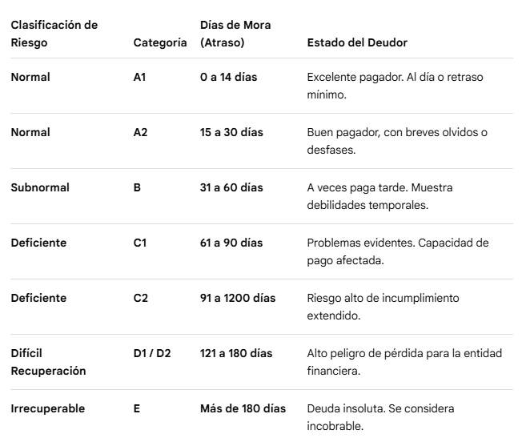

# ESPECIFICACIÓN DE LA MISIÓN: Sistema de Alerta Temprana de Morosidad para Banco Agrícola

## 1. Contexto y Objetivo del Proyecto
Estamos construyendo un de Sistema de Alerta Temprana de Morosidad (Early Warning Arrears System) para un hackathon de Banco Agrícola. El sistema no solo debe predecir *si* un cliente caerá en impago, sino *exactamente cuándo y por cuánto tiempo* basándose en una línea de tiempo específica de días de atraso. 

El objetivo de negocio no es la cobranza punitiva, sino el **Bienestar Financiero Proactivo**. Al detectar las líneas de tiempo de morosidad antes de que escalen, Banco Agrícola puede activar flujos de trabajo de mitigación automatizados y adaptados a la gravedad exacta del atraso.

**Dataset:** Home Credit Default Risk pulleado directo de la API de kaggle.

## 2. Restricciones Globales y Arquitectura (Reglas Críticas)
1. **Algoritmo del Modelo:** Usa 4 modelos para comparar, LightGB, XGBoost, Random Forest, otro.
2. **Manipulación de Datos:** Prioriza código de Pandas/NumPy limpio y legible sobre pipelines complejos. La primera etapa es la limpieza de datos, para ello haz el EDA y da la propuesta de limpieza para cada caso y por qué.
3. **Estrategia de Validación:** Usa `StratifiedKFold` (5 folds) para una validación cruzada robusta.
4. **Explicabilidad Primero:** Las predicciones de caja negra (black-box) son inaceptables para los ejecutivos bancarios. Debes calcular y visualizar los valores SHAP para explicar los factores específicos detrás de cada predicción.

## 3. Fase 1: Ingeniería del Target (Lógica de Negocio Multi-Horizonte)
Estamos replanteando el problema estándar de incumplimiento binario a una predicción multiclase basada en el número exacto de días de atraso. Ignora la columna `TARGET` por defecto en `application_train.csv`. Dado que así maneja la superintendencia del sistema financiero de el salvador la salud de un cliente bancario, dada la normativa (Norma NCB-022 previamente ahora NASF-09 en la SSF)

 (Donde dice 1200, está erroneo, es 1200, ya que esto es un sistema preventivo nos enfocaremos en tener granularidad en los tiers altos, por ello se mantiene A1, A2, B, C1 y C2 se fusionan en C, y D en adelante se funciona en 1.

Usando `installments_payments.csv`:
1. Calcula los días de atraso: `DAYS_ENTRY_PAYMENT - DAYS_INSTALMENT`. (Valores positivos = atraso).
2. Trunca cualquier atraso > 365 a exactamente 365.
3. Identifica el atraso máximo para cada usuario y crea una nueva columna objetivo (target) `arrears_class` con las siguientes clases:
   - **Clase A1:** 0 a 14 días de atraso.
   - **Clase A2:** 15 a 30 días de atraso.
   - **Clase B:** 31 a 60 días de atraso.
   - **Clase C:** 61 a 120 días de atraso.
   - **Clase D/E:** 121 a 365 días de atraso (todos los valores >365 caen aquí).
   - **Clase Healthy (Sano):** Valores negativos (pagado antes de tiempo o exactamente a tiempo con 0 días de atraso).

## 4. Fase 2: Ingeniería de Características (Blueprint de los Ganadores de Kaggle)
Construye las siguientes características específicas, las cuales demostraron matemáticamente proporcionar la mayor ganancia de información en la competencia de Kaggle:

**A. Ratios Financieros Inteligentes (de `application_train.csv`)**
- `credit_annuity_ratio`: `AMT_CREDIT / AMT_ANNUITY`
- `credit_goods_price_ratio`: `AMT_CREDIT / AMT_GOODS_PRICE`
- `debt_credit_ratio`: `AMT_CREDIT_SUM_DEBT / AMT_CREDIT_SUM` (si se unen los datos del buró, de lo contrario, omitir)
- `credit_downpayment`: `AMT_GOODS_PRICE - AMT_CREDIT`
- `age_in_years`: `int(DAYS_BIRTH / 365)`

**B. Agregaciones de Recencia en Bloques de Tiempo (de `installments_payments.csv`)**
No agregues simplemente todo el historial. Calcula agregaciones (mean, max, sum) filtradas por los últimos 60, 90, 180 y 365 días basados en `DAYS_INSTALMENT`.

**C. KPIs de Comportamiento de Pago Incompleto (Underpayment)**
- `installment_payment_ratio`: La media (mean) de `(AMT_PAYMENT - AMT_INSTALMENT)` agrupada por `SK_ID_CURR`. (Valores negativos indican que el usuario está pagando menos de lo que debe).
- `annuity_to_max_installment_ratio`: `AMT_ANNUITY / MAX(AMT_INSTALMENT)` de la tabla de installments.

## 5. Fase 3: Entrenamiento del Modelo
- Objetivo (Objective): `multi:softprob` (Para generar arreglos de probabilidad para las 6 clases).
- Usa una tasa de aprendizaje pequeña (e.g., `0.001` a `0.005`) y una profundidad de árbol moderada.
- Guarda el artefacto del modelo entrenado (`model_abcd.pkl`).